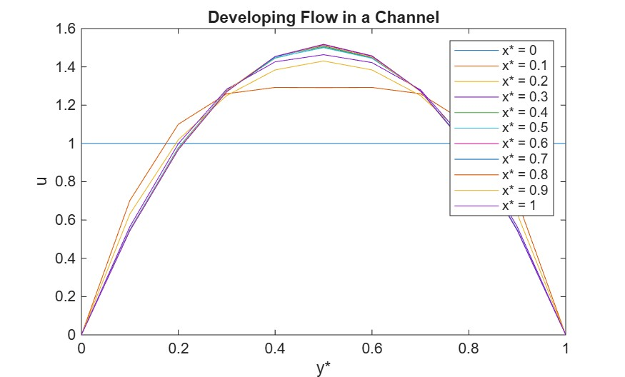
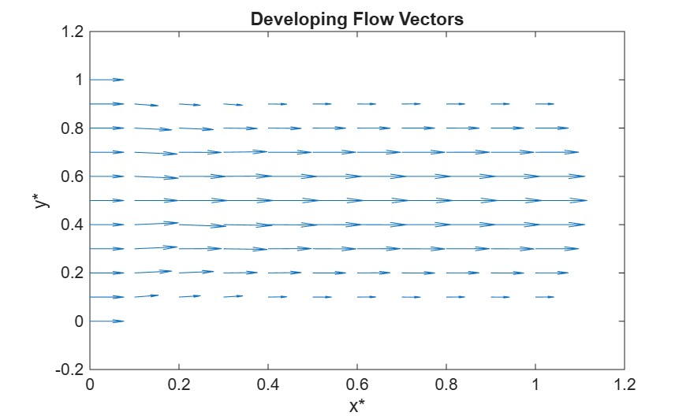

# Developing-Channel-CFD

## Abstract
Wrote a MATLAB program simulating a steady, two-dimensional, incompressible flow with constant properties by applying the finite volume method. The program uses a Mash Convergence study to find the optimal size for the Tri-diagonal Matrix Algorithm to discretize a non-dimensional model. 

## Results

## Verification
This is verified by comparing the results to numeric predictions, a polynomial approximation of the boundary layer, and the commencement flow in a circular pipe. 